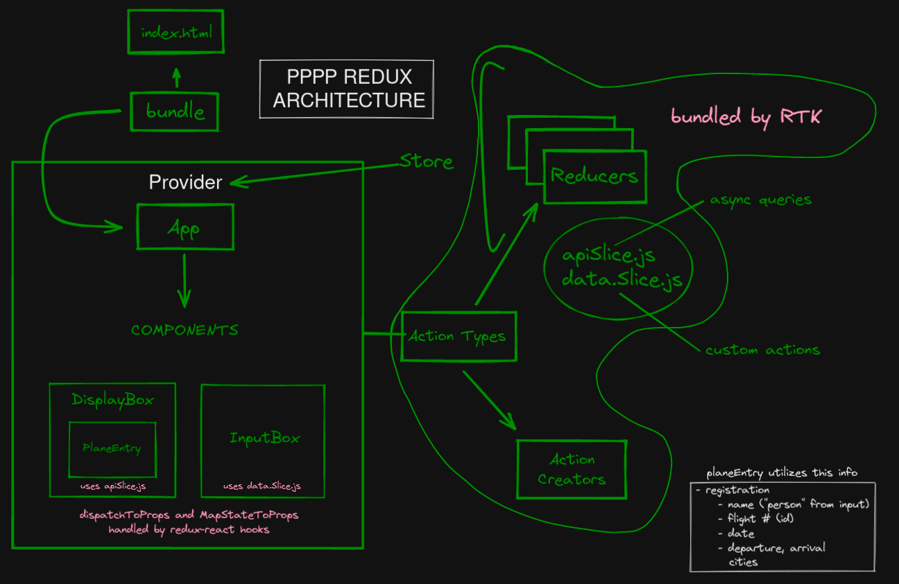
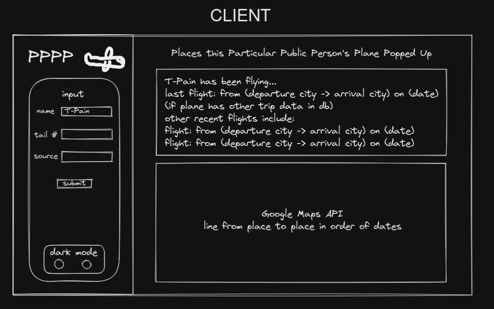

```
                     /$$       /$$ /$$          
                    | $$      | $$|__/          
  /$$$$$$  /$$   /$$| $$$$$$$ | $$ /$$  /$$$$$$$
 /$$__  $$| $$  | $$| $$__  $$| $$| $$ /$$_____/
| $$  \ $$| $$  | $$| $$  \ $$| $$| $$| $$      
| $$  | $$| $$  | $$| $$  | $$| $$| $$| $$      
| $$$$$$$/|  $$$$$$/| $$$$$$$/| $$| $$|  $$$$$$$
| $$____/  \______/ |_______/ |__/|__/ \_______/
| $$                                            
| $$                                            
|__/                                     /$$           /$$          
                                        | $$          | $/          
  /$$$$$$   /$$$$$$   /$$$$$$   /$$$$$$ | $$  /$$$$$$ |_/   /$$$$$$$
 /$$__  $$ /$$__  $$ /$$__  $$ /$$__  $$| $$ /$$__  $$     /$$_____/
| $$  \ $$| $$$$$$$$| $$  \ $$| $$  \ $$| $$| $$$$$$$$    |  $$$$$$ 
| $$  | $$| $$_____/| $$  | $$| $$  | $$| $$| $$_____/     \____  $$
| $$$$$$$/|  $$$$$$$|  $$$$$$/| $$$$$$$/| $$|  $$$$$$$     /$$$$$$$/
| $$____/  \_______/ \______/ | $$____/ |__/ \_______/    |_______/ 
| $$                          | $$                                  
| $$                          | $$                                  
|__/       /$$                |__/                  
          | $$                                            
  /$$$$$$ | $$  /$$$$$$  /$$$$$$$   /$$$$$$   /$$$$$$$    
 /$$__  $$| $$ |____  $$| $$__  $$ /$$__  $$ /$$_____/    
| $$  \ $$| $$  /$$$$$$$| $$  \ $$| $$$$$$$$|  $$$$$$     
| $$  | $$| $$ /$$__  $$| $$  | $$| $$_____/ \____  $$    
| $$$$$$$/| $$|  $$$$$$$| $$  | $$|  $$$$$$$ /$$$$$$$/ /$$
| $$____/ |__/ \_______/|__/  |__/ \_______/|_______/ | $/
| $$                                                  |_/ 
| $$                                                      
|__/       /$$             /$$       /$$                     /$$
          | $$            | $$      | $$                    | $$
  /$$$$$$ | $$  /$$$$$$  /$$$$$$   /$$$$$$    /$$$$$$   /$$$$$$$
 /$$__  $$| $$ /$$__  $$|_  $$_/  |_  $$_/   /$$__  $$ /$$__  $$
| $$  \ $$| $$| $$  \ $$  | $$      | $$    | $$$$$$$$| $$  | $$
| $$  | $$| $$| $$  | $$  | $$ /$$  | $$ /$$| $$_____/| $$  | $$
| $$$$$$$/| $$|  $$$$$$/  |  $$$$/  |  $$$$/|  $$$$$$$|  $$$$$$$
| $$____/ |__/ \______/    \___/     \___/   \_______/ \_______/
| $$                                                            
| $$                                                            
|__/                                                            

a project by Adnan Pervez, Bruno Albero, Evie Wylie, and Joey Friedman
```
--- 

# Introduction

Hello! Welcome to the readme for Public People's Planes, Plotted (PPPP).

Wunderpuss Photogenicus' PPPP was unashamedly inspired by a [story](https://www.protocol.com/elon-musk-flight-tracker) you may have seen, and made alluring by the existence of [flight tracking APIs](https://geekflare.com/flight-data-api/), as well as the availability of information about the planes that the rich & famous own. Not only is this information available through social media, but also through resources like [this](https://www.superyachtfan.com/private-jet/). 

The original goal was to use the plane registration numbers, colloquially referred to as their tail numbers, in order to sift through data the FAA makes plainly accessible which is handled and distributed by a number of services with APIs. In our experience, however, a number of these APIs would make it appear as though you could pull all of their data with a limited number of requests, as other basic/free-tier APIs commonly offer, but when you actually tried to pull the relevant information, the registration numbers would be obfuscated and locked behind a higher payment tier. We wouldn't have gotten so deep into this if that information had been made clear on the websites or documentation of the APIs we tried, but alas, the sunk cost fallacy didn't feel like so much of a fallacy given the limited amount of time we had to tackle the project. 

That being said, we forged onward, populating a MongoDB database with information modeled after the information we *would* have pulled from the API given the ability to parse the objects of data we were receiving by making a request to the API using the plane registration (which this document may refer to interchangeably as 'tail #'). To be clear, our database documents (labelled 'plane' under the collection 'planes') used fields available to one who has the ability to make requests to the API by inputting a tail #. *Sigh.*

--- 

# Tech Stack

PPPP utilizes only a few core technologies for hope that it could potentially have the capacity to expand greatly in scale/scope.

## Frontend:
- React-Redux w/ redux toolkit (RTK), RTK being a boilerplate handler and collection of extremely useful middleware, drastically reducing the amount of redux boilerplate to write if you understand how. A key example of this boiler plate distillation is the file "client/reducers/data.Slice.js", where actions, action types, and reducers are all created in the body of a createSlice function that gets exported.
- RTKQuery, an included feature in RTK to make handling asynchronous calls within redux components simple and straightforward. This is necessary because redux components are already asynchronous, which means [vanilla redux only supports synchronous data flow](https://stackoverflow.com/questions/34570758/why-do-we-need-middleware-for-async-flow-in-redux/34599594#34599594). You can see how RTK Query is set up in "client/reducers/apiSlice.js", and it may take a bit of reading (documentation is linked in that file) to wrap your head around, but once you do it's ridiculously easy to use - check out the invocation of the useGetPlanesQuery within "client/components/DisplayBox.jsx" for an example. 
- React hooks, which don't require an import, but do involve writing functional components and referencing the state (redux's store) a little bit differently (and far more concisely). These should mostly be pointed out by comments within the code itself, but it is worth looking into the documentation for a much better explanation of what's going on under the hood. 
- SCSS. Our stylesheet was the lowest priority file given what we aimed to accomplish with the frontend, and we didn't have much time to make it look presentable. 

## Backend: 
- Node-Express is all we know when it comes to handling APIs and the backend of web applications.
- MongoDB object modeling for Node.js. "Mongoose provides a straight-forward, schema-based solution to model your application data. It includes built-in type casting, validation, query building, business logic hooks and more, out of the box." What more is there to say?
- *Unused: Axios. Our API controller in "server/controllers/apiController.js" - before we switched over to using dummy data we input into the MongoDB database we used ourselves - used axios to handle making HTTP requests, for the sake of getting experience with another common tool to handle making these requests.

--- 

# Diagrams

Below are some diagrams to illuminate how we were thinking about our data flow, our file architecture for redux (highlighting how RTK changes things), and our original vision for the client, including the stretch feature of the google map API implementation, which we simply didn't have enough time to implement cleanly.

## Data Flow


## Redux Architecture


## Client


---

# Important Notes
- The controllers *folder* is not being used in the current state of the application. The controller *folder* contains our original controller file, which involved having middleware that would fetch from the API. It is connected to a different MongoDB. No part of the application points to the file in that folder.
- If you have any questions about RTK, RTKQuery, MongoDB, or Mongoose, hit us up!
- We only ever ran the dev side, with the script being used by entering "npm run dev". If you choose to try the production build of the application, you're entering uncharted territory, and we hope you'll send us a postcard.
- If you read all the way through this, this [bonus](https://youtu.be/baNp8bgOtok) is for you.
